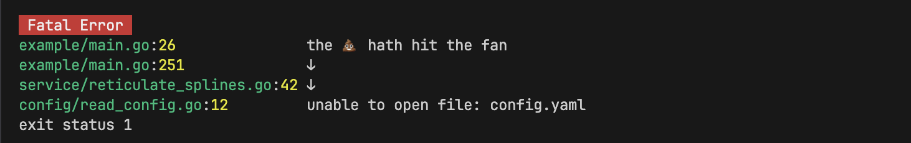

# 💩 poop

The idea of chained or wrapped errors in Go have been around for a long time and have been in the standard library since Go 1.13. However, there seems to be some reluctance in the standard library to capturing caller information. But caller information is kind of awesome. This library is a chained error library with no such hesitation.

## Status

Alpha, First Draft, Used by me and me only ... for now.

## Installation

```bash
go get github.com/kellegous/poop@latest
```

## Usage

Most common use is to simply capture the current caller and wrap an error that was produced by another call.

```go
if err != nil {
	return poop.Chain(err)
}
```

To chain an and error and add a custom message to the link in the chain,

```go
if err != nil {
	return poop.Chainf(err, "unable to fetch object id=%d", id)
}
```

To terminate the program do to an error,

```go
if err != nil {
	poop.HitFan(err)
}
```


